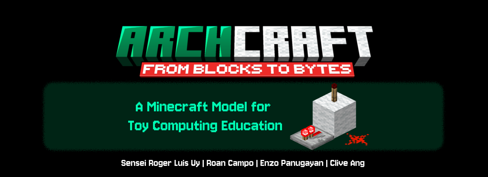

**CSARCH2 Case Study 2: Microprogramming in Minecraft**

A 16-bit CPU implemented through Logisim Evolution and simulated via Redstone circuitry in Minecraft. 

This project emphasizes microprogramming, control sequencing, and arithmetic unit design at the hardware abstraction level.

> [!note]
> Recommended Minecraft version: **1.20.4**

## Important Resources

- **Microcode Document for the Case Study**  
[View the Document](https://docs.google.com/spreadsheets/d/1nXDbPkBSaaQgP0F9nRp57YK5BtLBGyWU8lGllRv6LNw/edit?usp=sharing)

# Set up

The Minecraft world is located in the `/game/` directory of this repository.  
Run it using the Minecraft Launcher with **Fabric 1.20.4** installed.

Each group has a unique variant with project specifications outlining their tasks.

Optional Fabric mods can be installed to enhance your building and gameplay experience, it is recommended to install the following Fabric mods, all available on Modrinth. 

## Project Overview

This case study focuses on implementing a partial 16-bit CPU with an emphasis on:
- **Arithmetic Logic Unit (ALU)** with standard and custom operations.
- **Control Unit** implementing microinstruction-based execution.
- **Microprogrammed Execution** of algorithms.

Each group must design their own microcode logic and demonstrate correct data flow and control sequencing. This will allow them to gain practical understanding of how microinstructions coordinate different CPU components.

## Learning Objectives

Upon completion, students will be able to:
- Explain how microinstructions control data flow and component interaction within a CPU.
- Emulate and understand how functions and control transfer works within the computer.
- Simulate instruction execution based on a predefined opcode set.
- Evaluate the effectiveness of using gamified platforms like Minecraft in supporting the understanding of complex concepts in computer architecture.

## Project Structure

### CPU Cycle Implementation
- **8 cycles per instruction**
  - **Fetch + Decode:** 3 cycles (pre-implemented)
  - **Execute:** 5 cycles (student microcode implementation)

### Control Signals

The implementation uses a comprehensive set of microcode control signals including:

| **Category** | **Signal** | **Description** |
|---------------|-------------|-----------------|
| **Instruction Register** | **IRin** | Inputs into the Instruction Register to decode |
|  | **IRDFout** | Outputs the Data Field from the decoded instruction |
|  | **IRAFout** | Outputs the Address Field from the decoded instruction |
|  | **SEL OTR** | Selects either the 2nd and 3rd nibble or the 3rd and 4th nibble from the IR |
| **Arithmetic Logic Unit (ALU)** | **SELECT Y** | Selects the Y Register for ALU operations |
|  | **SELECT 4** | Selects constant value 4 as ALU input |
|  | **Yin** | Inputs into the Y Register for ALU computation |
|  | **SET C** | Sets the Carry Flag to 1 |
|  | **ALU MUL** | Performs multiplication (X × Y) |
|  | **ALU DIV** | Performs division (X ÷ Y) |
|  | **ALU ADD** | Performs addition (X + Y) |
|  | **ALU SUB** | Performs subtraction (X − Y) |
|  | **ALU AND** | Performs bitwise AND (X ∧ Y) |
|  | **ALU OR** | Performs bitwise OR (X ∨ Y) |
|  | **ALU XOR** | Performs bitwise XOR (X ⊕ Y) |
|  | **ALU NOT** | Performs bitwise NOT (¬X) |
|  | **Zin** | Inputs the ALU result into the Z Register |
|  | **Z1out** | Outputs lower 16 bits of the Z Register |
|  | **Z2out** | Outputs upper 16 bits of the Z Register |
|  | **ENABLE FLAG** | Enables or updates the ALU status flags |
|  | **WAFC** | Wait for ALU Function Complete signal |
| **Main Memory** | **MARin** | Inputs to the Memory Address Register |
|  | **MARout** | Outputs the Memory Address Register contents |
|  | **MDRin** | Inputs data to the Memory Data Register |
|  | **MDRout** | Outputs data from the Memory Data Register |
|  | **READ** | Reads data from address in MAR into MDR |
|  | **WRITE** | Writes data from MDR into address in MAR |
|  | **WMFC** | Wait for Memory Function Complete signal |
| **Program Counter** | **PCin** | Inputs address into the Program Counter |
|  | **PCout** | Outputs the current instruction address |
|  | **RESET PC** | Resets the Program Counter to 0 |
| **Registers** | **REGAin** | Inputs data into Register A |
|  | **REGAout** | Outputs data from Register A |
|  | **REGBout** | Outputs data from Register B |
|  | **SPin** | Inputs data into the Stack Pointer Register *(modifiable if needed)* |
|  | **SPout** | Outputs data from the Stack Pointer Register *(modifiable if needed)* |

## Core Mods

These are required or highly recommended for core functionality and quality of life.

| Name                      | Version  | Link                                                       |
| ------------------------- | -------- | ---------------------------------------------------------- |
| Axiom                     | 4.9.1    | [Modrinth](https://modrinth.com/mod/axiom)                 |
| Bobby                     | 5.1.0    | [Modrinth](https://modrinth.com/mod/bobby)                 |
| Cloth Config              | 13.0.138 | [Modrinth](https://modrinth.com/mod/cloth-config)          |
| Fabric API                | 0.97.2   | [Modrinth](https://modrinth.com/mod/fabric-api)            |
| Mod Menu                  | 9.2.0    | [Modrinth](https://modrinth.com/mod/modmenu)               |
| Xaero's Minimap           | 25.2.6   | [Modrinth](https://modrinth.com/mod/xaeros-minimap)        |
| Xaero's World Map         | 1.39.9   | [Modrinth](https://modrinth.com/mod/xaeros-world-map)      |
| Yet Another Config Lib v3 | 3.6.6    | [Modrinth](https://modrinth.com/mod/yacl)                  |

## Auxiliary Mods

These are optional but highly recommended to improve FPS and reduce lag.

| Name           | Version | Link                                               |
| -------------- | ------- | -------------------------------------------------- |
| Dynamic FPS    | 3.9.4   | [Modrinth](https://modrinth.com/mod/dynamic-fps)   |
| Entity Culling | 1.7.4   | [Modrinth](https://modrinth.com/mod/entityculling) |
| FerriteCore    | 6.0.3   | [Modrinth](https://modrinth.com/mod/ferrite-core)  |
| Iris           | 1.7.2   | [Modrinth](https://modrinth.com/mod/iris)          |
| Lithium        | 0.12.1  | [Modrinth](https://modrinth.com/mod/lithium)       |
| Sodium         | 0.5.8   | [Modrinth](https://modrinth.com/mod/sodium)        |
| Sodium Extra   | 0.5.4   | [Modrinth](https://modrinth.com/mod/sodium-extra)  |

## Academic Integrity

### Permitted Activities
- Reviewing redstone tutorials and online references to learn basic redstone logic and component behavior.
- Reusing simple redstone components or design patterns (e.g., flip-flops, logic gates) as long as they are not part of an entire working CPU or full subsystem.
- Using SASM or other IDEs designed for assembly languages to test program functionality. 

### Prohibited Activities
- Sharing world files, redstone circuits, algorithm implementations, or opcode implementations between groups.
- Replicating another group’s exact design, even if obtained through informal means (e.g., screenshots, videos, word-of-mouth).
- Copying another group's implementation
- Using command blocks or any form of automation to manipulate or alter circuitry in a way that bypasses the logic design (e.g., teleporting data, triggering hidden commands).

## Multiplayer
Groups may work collaboratively using LAN or **Tailscale** for remote access.

Note that one of the mods, Axiom, are disabled in multiplayer play; please head to the Axiom discord and request to be whitelisted.

The following are instructions on how to accomplish this.

> [!warning]
> Disclaimer: Use of Tailscale
> This project includes optional instructions for using Tailscale, a third‑party networking tool, to enable virtual LAN gameplay for Minecraft.
>
> While Tailscale is a secure and widely used VPN service, installing and running it may trigger warnings or alerts from:
>
> - Corporate or school IT policies (if used on managed devices)
> - Antivirus or firewall software
> - Network monitoring or intrusion detection systems (IDS)
>
> Other applications may get affected by using a VPN, so please proceed with caution.

### Steps for Tailscale “LAN” Server for Minecraft

#### 1. Install Tailscale

On every computer (host + clients), download and install Tailscale for your OS:

Windows/macOS/Linux: <https://tailscale.com/download>

Launch Tailscale and log in with the **same account** (or join the same Tailscale team/network).

#### 2. Verify Your Tailscale IPs

Open a terminal or Tailscale UI.

Note each device’s Tailscale IP (usually in the 100.x.y.z range).

Make sure you can ping between devices:

```cmd
ping 100.x.y.z   # replace with another player’s Tailscale IP
```

#### 3. Prepare the Minecraft World

On the host machine, copy the world folder into …/.minecraft/saves/.

Launch Minecraft 1.20.4 with Fabric + all required mods installed.

#### 4. Open to LAN on the Host

In Minecraft, load your world, and share your port in 25565.

Press Esc → Open to LAN.

Choose game mode & allow cheats if desired → Start LAN World.

Note the port number shown, e.g.: `Local game hosted on port 25565`

#### 5. Join via Tailscale IP

On each client machine, launch Minecraft (same version + mods).

Go to Multiplayer → Direct Connect.

Enter:`<Host’s Tailscale IP>:<PORT>`

Example:`100.101.102.103:50432`

Click Join Server.

### Troubleshooting Tips

Firewall: Ensure the host’s firewall allows incoming TCP on the chosen port (default 25565 range and the LAN port).

Mod Mismatch: Double‑check that everyone’s Fabric loader & mods exactly match (same versions).

Tailscale ACLs: If you’re on a team network with ACLs, ensure all devices are allowed to connect to each other (or use an “exit node” configuration).

## Disclaimer

> [!warning]
> This repository contains a Minecraft world save showcasing in-game computers and redstone builds.
>
> Minecraft™ is a trademark of Mojang AB. This project is not affiliated with, endorsed by, or associated with Mojang AB, Microsoft, or any of their subsidiaries.
>
> All screenshots, images, and in-game builds shown here are fan-made creations, shared for educational and entertainment purposes only.
>
> You may use, modify, or share this world save freely, but you may not sell it or represent it as an official Mojang/Microsoft product.