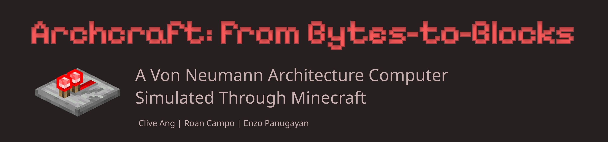

**CSARCH2 Case Study 2: Microprogramming in Minecraft**

A 16-bit computer simulated on logisim evolution and simulated in Minecraft.
 
> [!note]
> It is recommended to use 1.20.4.

> [!important]
> YouTube Recording to the Videos: https://www.youtube.com/playlist?list=PLdnTrCZr5VqXToGZzOzMa7h_MyH81vmxS
> YouTube Recording on how to Migrate to the New Template World and use the Memory Loader: https://youtu.be/Q0-cmD1smA8

# Set up

The Minecraft world file can be found in the /game/ directory of this repository. Please run this on the Minecraft launcher on `1.20.4`.

Each group should have already received the project specifications outlining their tasks.

Though not required, you can enhance your building and gameplay experience, it is recommended to install the following Fabric mods, all available on Modrinth. 


## Project Overview

This case study focuses on implementing a partial 16-bit CPU with emphasis on:
- **Arithmetic Logic Unit (ALU)** with custom operations
- **Control Unit** with microprogram control signals
- **Register Controller** for data transfer operations
- **Instruction execution** without control flow operations

Students build and connect redstone circuits to simulate real CPU behavior, gaining practical understanding of how microinstructions coordinate different CPU components.

## Learning Objectives

Upon completion, students will be able to:
- Explain how microinstructions control data flow and component interaction within a CPU
- Design and implement a functional ALU using redstone logic components
- Simulate instruction execution based on a predefined opcode set
- Evaluate the effectiveness of gamified platforms in understanding complex architectural concepts


## Project Structure

### CPU Cycle Implementation
- **8 CPU cycles per instruction** (modified for Minecraft limitations)
- **Fetch & Decode**: 3 cycles (pre-implemented)
- **Execute**: 5 cycles (student implementation required)

### Control Signals
The implementation uses a comprehensive set of microcode control signals including:
- **Instruction Register**: IRin, IRDFout, IRAFout, SELECT
- **ALU Operations**: SELECT Y, SELECT 4, ALU OP0-OP2, Zin, Zout
- **Memory Operations**: MARin, MARout, MDRin, MDRout, READ, WRITE
- **Register Operations**: REGin, REGout, SWAP OUT
- **Program Counter**: PCin, PCout, RESET PC


## Core Mods
These are required or highly recommended for core functionality and quality of life.

| Name                      | Version  | Link                                                       |
| ------------------------- | -------- | ---------------------------------------------------------- |
| Axiom                     | 4.9.1    | [Modrinth](https://modrinth.com/mod/axiom)                 |
| AppleSkin                 | 2.5.1    | [Modrinth](https://modrinth.com/mod/appleskin)             |
| Bobby                     | 5.1.0    | [Modrinth](https://modrinth.com/mod/bobby)                 |
| Cloth Config              | 13.0.138 | [Modrinth](https://modrinth.com/mod/cloth-config)          |
| Fabric API                | 0.97.2   | [Modrinth](https://modrinth.com/mod/fabric-api)            |
| Mod Menu                  | 9.2.0    | [Modrinth](https://modrinth.com/mod/modmenu)               |
| Not Enough Animations     | 1.9.3    | [Modrinth](https://modrinth.com/mod/not-enough-animations) |
| Xaero's Minimap           | 25.2.6   | [Modrinth](https://modrinth.com/mod/xaeros-minimap)        |
| Xaero's World Map         | 1.39.9   | [Modrinth](https://modrinth.com/mod/xaeros-world-map)      |
| Yet Another Config Lib v3 | 3.6.6    | [Modrinth](https://modrinth.com/mod/yacl)                  |

## Auxiliary Mods

These are optional but highly recommended to improve FPS and reduce lag.

| Name           | Version | Link                                               |
| -------------- | ------- | -------------------------------------------------- |
| Dynamic FPS    | 3.9.4   | [Modrinth](https://modrinth.com/mod/dynamic-fps)   |
| Entity Culling | 1.7.4   | [Modrinth](https://modrinth.com/mod/entityculling) |
| FerriteCore    | 6.0.3   | [Modrinth](https://modrinth.com/mod/ferrite-core)  |
| Iris           | 1.7.2   | [Modrinth](https://modrinth.com/mod/iris)          |
| Lithium        | 0.12.1  | [Modrinth](https://modrinth.com/mod/lithium)       |
| Sodium         | 0.5.8   | [Modrinth](https://modrinth.com/mod/sodium)        |
| Sodium Extra   | 0.5.4   | [Modrinth](https://modrinth.com/mod/sodium-extra)  |

## Academic Integrity

### Permitted Activities
- Reviewing redstone tutorials and basic logic components
- Reusing simple redstone patterns (flip-flops, logic gates)

### Prohibited Activities
- Sharing world files or circuit designs between groups
- Using command blocks or automation
- Copying another group's implementation

## Multiplayer
If you are wish and plan to accomplish this project with you groupmates within Minecraft, you host the Minecraft world so others on the same Wi‑Fi or LAN can join. 

Note that one of the mods, Axiom, are disabled in multiplayer play; please head to the Axiom discord and request to be whitelisted.

The following are instructions on how to accomplish this.

> [!warning]
> Disclaimer: Use of Tailscale
> This project includes optional instructions for using Tailscale, a third‑party networking tool, to enable virtual LAN gameplay for Minecraft.
>
> While Tailscale is a secure and widely used VPN service, installing and running it may trigger warnings or alerts from:
>  - Corporate or school IT policies (if used on managed devices)
>  - Antivirus or firewall software
>  - Network monitoring or intrusion detection systems (IDS)
>
> Other applications may get affected by using a VPN, so please proceed with caution.

### Steps for Tailscale “LAN” Server for Minecraft

#### 1. Install Tailscale

On every computer (host + clients), download and install Tailscale for your OS:

Windows/macOS/Linux: https://tailscale.com/download

Launch Tailscale and log in with the **same account** (or join the same Tailscale team/network).

#### 2. Verify Your Tailscale IPs

Open a terminal or Tailscale UI.

Note each device’s Tailscale IP (usually in the 100.x.y.z range).

Make sure you can ping between devices:
```cmd
ping 100.x.y.z   # replace with another player’s Tailscale IP
```

#### 3. Prepare the Minecraft World

On the host machine, copy the world folder into …/.minecraft/saves/.

Launch Minecraft 1.20.4 with Fabric + all required mods installed.

#### 4. Open to LAN on the Host

In Minecraft, load your world, and share your port in 25565.

Press Esc → Open to LAN.

Choose game mode & allow cheats if desired → Start LAN World.

Note the port number shown, e.g.: `Local game hosted on port 25565`

#### 5. Join via Tailscale IP
On each client machine, launch Minecraft (same version + mods).

Go to Multiplayer → Direct Connect.

Enter:`<Host’s Tailscale IP>:<PORT>`

Example:`100.101.102.103:50432`

Click Join Server.

### Troubleshooting Tips
Firewall: Ensure the host’s firewall allows incoming TCP on the chosen port (default 25565 range and the LAN port).

Mod Mismatch: Double‑check that everyone’s Fabric loader & mods exactly match (same versions).

Tailscale ACLs: If you’re on a team network with ACLs, ensure all devices are allowed to connect to each other (or use an “exit node” configuration).

## Disclaimer

> [!warning]
> This repository contains a Minecraft world save showcasing in-game computers and redstone builds.
>
> Minecraft™ is a trademark of Mojang AB. This project is not affiliated with, endorsed by, or associated with Mojang AB, Microsoft, or any of their subsidiaries.
>
> All screenshots, images, and in-game builds shown here are fan-made creations, shared for educational and entertainment purposes only.
>
> You may use, modify, or share this world save freely, but you may not sell it or represent it as an official Mojang/Microsoft product.
